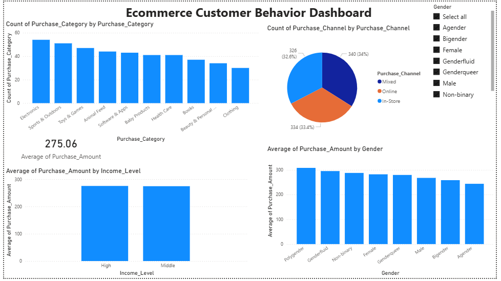

# 📊 Purchase Intelligence Dashboard

## 🚀 Project Overview
This project focuses on analyzing customer purchase behavior using real-world ecommerce data.  
I explored how different factors like gender, income level, and product categories influence spending patterns.

---

## 🛠️ Tools Used
- SQL (SQLite) – for data analysis  
- Power BI – for dashboard creation  
- Excel – for data cleaning  

---

## 📈 Key Insights
- Identified top-performing purchase categories  
- Analyzed average spending across different income groups  
- Compared spending behavior between genders  
- Studied distribution of purchase channels  

---

## 📊 Dashboard Preview

---

## ⚡ Features
- Interactive dashboard with slicer (Gender filter)  
- Clean and structured visualizations  
- Easy to understand business insights  

---

## 📂 Project Files
- `dataset.csv` → raw dataset  
- `dashboard.pbix` → Power BI dashboard  
- `queries.sql` → SQL queries used  

---

## 💡 What I Learned
- How to clean and prepare real-world data  
- Writing SQL queries for analysis  
- Building interactive dashboards in Power BI  
- Turning data into meaningful insights  

---

## 🎯 Conclusion
This project helped me understand customer behavior and how data can be used to support business decisions.
